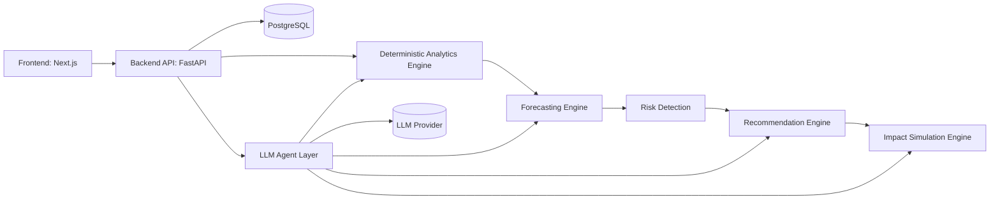

# Financial Health Copilot

**From transactions to action — understand your money, see what's coming, and know exactly what to do about it.**

## Problem

Most people have their financial life scattered across bank accounts, credit cards, loans, and investments. They can see individual balances and transactions, but nobody tells them the story those numbers add up to: *Am I okay? What's about to go wrong? What should I actually do — and will it even help?*

Existing apps stop at dashboards. They show pie charts of spending but never connect the dots to a decision.

## Solution

Financial Health Copilot ingests a user's transactions, income, debts, and savings behavior and turns them into a continuous loop:

```
DATA → INSIGHT → RISK/OPPORTUNITY → RECOMMENDATION → EXPECTED IMPACT
```

Every insight is labeled as an **observed fact**, a **prediction**, or a **recommendation**, each carrying a confidence level. Users can ask questions in plain language ("Can I afford a ₹30,000 phone?") and get grounded, numeric answers — not generic advice like "spend less." When new transactions arrive, the whole picture — and the recommendations — recalculate and visibly change.

## Key Capabilities

- **Unified financial health view** — income, expenses, debt, savings, and cash flow in one model.
- **Risk detection** — low cash buffer, upcoming cash-flow gaps, debt pressure, spending spikes, income volatility.
- **Conversational Q&A** — natural-language questions grounded in deterministic financial calculations.
- **Impact simulation** — "what if I do X?" compares a baseline projection against a proposed-action projection.
- **Explainability** — every number traces back to observed data, every prediction states its confidence and assumptions.
- **Live recalculation** — add a transaction, income change, or new debt, and recommendations update visibly.

## How the System Works

1. Transactions and financial records (synthetic for the demo) are ingested and normalized.
2. A deterministic analytics layer computes income, expenses, savings rate, debt ratios, and cash-flow metrics — **never** left to an LLM.
3. A forecasting layer projects near-term cash flow using interpretable methods (rolling averages, recurring-payment schedules, trend lines) with explicit confidence intervals.
4. A rules-based risk engine flags emerging problems and opportunities from those projections.
5. A recommendation engine turns risks/opportunities into specific, quantified actions.
6. An LLM-powered conversational layer answers user questions by calling the above components as tools and explaining the results in plain language — it never invents numbers.
7. The frontend renders all of this as a story, not just a dashboard: *Where am I → What might happen → What should I do → What happens if I do it.*

## Architecture Overview



See `SYSTEM_ARCHITECTURE.md` for full detail.

## Technology Stack

| Layer | Choice |
|---|---|
| Frontend | Next.js (React) + TypeScript + Tailwind CSS + Recharts |
| Backend | Python + FastAPI |
| Database | PostgreSQL |
| Data processing | pandas |
| AI | LLM via tool-calling (Anthropic Claude), deterministic Python for all math |
| Auth | JWT-based email/password auth (simple, realistic) |
| Deployment | Docker Compose locally; Vercel (frontend) + Render/Railway (backend+DB) for hosted demo |

Full rationale in `TECH_STACK.md`.

## Major Features

- Financial Health Dashboard (facts, risks, and a health score at a glance)
- Spending & Recurring Payments breakdown
- Debt Overview with payoff projections
- Cash-Flow Forecast with confidence bands
- Recommendations feed with expected impact
- What-If Simulator
- AI Copilot chat

## Example User Questions

- "Where did most of my money go last month?"
- "Will I run out of cash before my next salary?"
- "What happens if I pay ₹10,000 extra toward my loan this month?"
- "Can I afford a ₹30,000 purchase right now?"
- "What should I focus on this month?"

## Example Recommendation

> **Observed:** Your average monthly discretionary spending is ₹18,400, largely food delivery (₹7,200) and subscriptions (₹2,100).
> **Prediction (medium confidence):** At current pace, projected month-end balance falls ₹3,000 below your preferred buffer.
> **Recommendation:** Reduce food-delivery spending by ₹3,000 this month.
> **Expected impact:** Month-end balance improves by ~₹3,000; cash-flow buffer increases from 4 days to 9 days.

## Example Impact Simulation

> **What if I pay ₹10,000 extra toward my personal loan this month?**
> Baseline payoff: 14 months remaining, ₹8,200 total interest remaining.
> With extra payment: 11 months remaining, ₹6,100 total interest remaining.
> Trade-off: month-end cash buffer drops from 9 days to 5 days.

## Demo Flow

1. Show the unified dashboard for a synthetic user.
2. Ask the copilot a spending question.
3. Show a detected risk (upcoming cash-flow gap).
4. Show the recommendation and its expected impact.
5. Run a what-if simulation live.
6. Inject a new transaction (e.g., a large expense) and show the dashboard and recommendations recalculate.

Full script in `DEMO_SCRIPT.md`.

## Project Structure

```
.
├── backend/           # FastAPI app: analytics, forecasting, risk, recommendations, agent, API
├── frontend/          # Next.js app
├── data/              # synthetic seed data (CSV/JSON)
├── docs/              # this documentation package
└── docker-compose.yml
```

## Local Setup (overview)

```bash
git clone <repo>
cd financial-health-copilot
cp .env.example .env        # add LLM API key
docker compose up --build   # starts db, backend, frontend
```
Full instructions in `IMPLEMENTATION_PLAN.md` and `BACKEND_ARCHITECTURE.md`.

## Future Scope

Open Banking / real bank feeds, better ML-based forecasting, goal tracking, investment analysis, credit score insights, bill negotiation, proactive alerts, and a mobile app. See `FUTURE_SCOPE.md`.

---
*Built for [Hackathon Name]. All financial data used in the demo is synthetic.*
