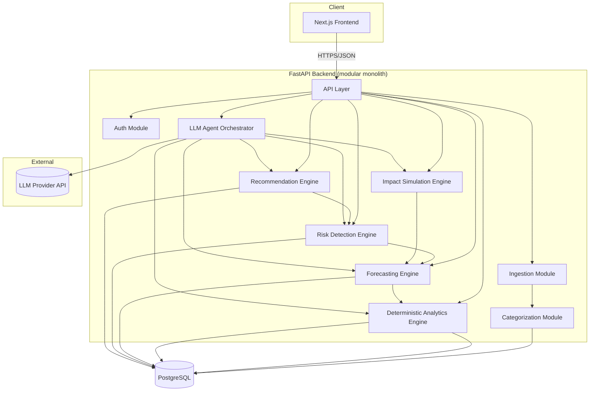
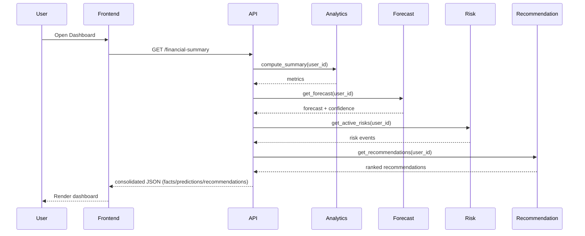
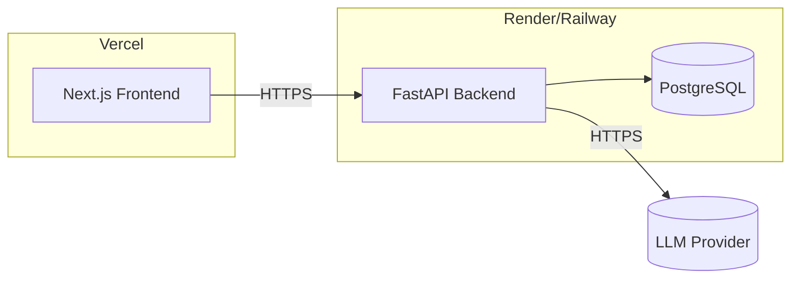

# System Architecture

## Guiding Principle

This is a **modular monolith**, not microservices. A hackathon team benefits from one deployable backend with clearly separated internal modules. Microservices would add network boundaries, deployment complexity, and debugging overhead with no benefit at this scale.

## High-Level Architecture



## Component Responsibilities

| Component | Responsibility |
|---|---|
| Frontend (Next.js) | Renders dashboard, chat UI, what-if simulator; calls backend REST API |
| API Layer | Auth, request validation, routing to modules, response shaping |
| Auth Module | Signup/login, JWT issuance/verification |
| Ingestion Module | Accepts raw transaction/account/loan/income data, validates, stores |
| Categorization Module | Normalizes merchants, assigns categories, detects recurring payments |
| Analytics Engine | Pure deterministic financial calculations (see `FINANCIAL_ANALYTICS.md`) |
| Forecasting Engine | Projects near-term cash flow with confidence (see `FORECASTING_AND_RISK.md`) |
| Risk Detection Engine | Evaluates rules against analytics/forecast output |
| Recommendation Engine | Converts risks/opportunities into ranked, quantified actions |
| Impact Simulation Engine | Runs baseline-vs-proposed projections for what-if queries |
| LLM Agent Orchestrator | Classifies intent, calls the above as tools, composes grounded natural-language responses |

## Request Flow (typical dashboard load)



## Data Processing Flow (new transaction arrives)

```mermaid
flowchart LR
    Raw[Raw Transaction] --> Validate[Validate]
    Validate --> Normalize[Normalize Merchant/Amount]
    Normalize --> Categorize[Categorize]
    Categorize --> RecurringCheck[Recurring Detection]
    RecurringCheck --> Store[(Persist)]
    Store --> Recalc[Trigger Recalculation]
    Recalc --> Metrics[Recompute Metrics]
    Metrics --> Forecast2[Recompute Forecast]
    Forecast2 --> Risk2[Re-evaluate Risks]
    Risk2 --> Reco2[Regenerate Recommendations]
    Reco2 --> Snapshot[Persist Snapshot for History/Diff]
```



## Conversational AI Flow

```mermaid
flowchart LR
    Q[User Question] --> Intent[Classify Intent]
    Intent --> ToolSelect[Select Tool(s)]
    ToolSelect --> ToolCall[Call Deterministic Tool(s)]
    ToolCall --> Result[Structured Result]
    Result --> Compose[LLM Composes Grounded Answer]
    Compose --> Label[Label Fact/Prediction/Recommendation + Confidence]
    Label --> Response[Response to User]
```

## Recommendation Flow

```mermaid
flowchart LR
    Metrics[Analytics Output] --> RiskEval[Risk Rule Evaluation]
    RiskEval --> Candidates[Candidate Recommendations]
    Candidates --> Dedup[Deduplicate]
    Dedup --> ImpactCalc[Compute Expected Impact via Simulation Engine]
    ImpactCalc --> Rank[Rank by Severity x Confidence x Impact]
    Rank --> Filter[Filter Low-Confidence / Insufficient-Data]
    Filter --> Output[Final Recommendation List]
```



## Deployment View (hackathon-scale)


